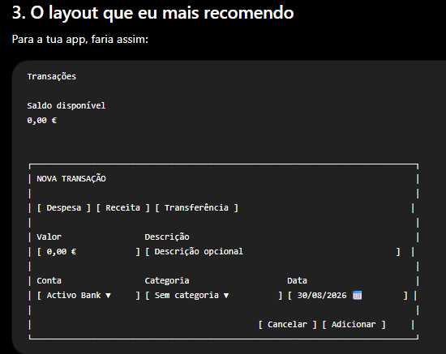
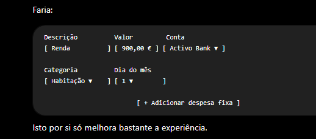
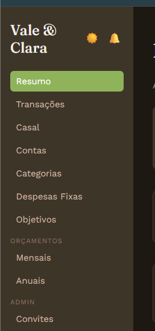
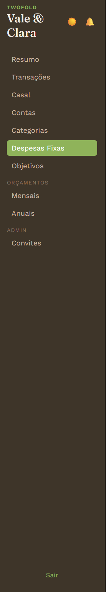

# Roadmap — o que falta

Fases 1, 2 e 3 do `docs/especificacao-produto.md` estão feitas (ver CLAUDE.md, secção "Funcionalidades"). Da Fase 4, falta só a importação de extratos (deixada para depois, de propósito).

## Fase 3 — Inteligência (feita)

- [x] Regras automáticas de categorização (`category_rules`, sugestão em `TransactionForm` a partir da descrição, gestão em `/categorias`)
- [x] Centro de notificações (`NotificationsBell` na sidebar — orçamento ultrapassado/quase, despesa fixa a vencer nos próximos 7 dias, objetivo que atingiu 75%/100%)
- [x] Insights em texto no Resumo (comparação com o mês anterior por categoria, peso da maior categoria, taxa de poupança vs. mês passado, previsão do saldo no fim do mês)
- [ ] Deteção de gastos fora do padrão (não feito — precisa de uma noção de "padrão normal" por categoria, ainda não definida)

## Fase 4 — UX

- [x] Gráficos (`recharts`) — `CategoryPieChart.jsx`, usado no Resumo e na página Casal (despesas por categoria)
- [x] Modo escuro — toggle 🌙/☀️ na sidebar, tokens em `src/index.css` (`[data-theme='dark']`), preferência guardada em `localStorage` (`src/lib/theme.js`), respeita `prefers-color-scheme` como default
- [x] PWA — `vite-plugin-pwa` (grátis/open source), instalável no telemóvel/desktop, `manifest.webmanifest` gerado no build
- [x] Pesquisa por texto na lista de Transações (por descrição ou categoria, em `/transacoes`)
- [ ] Importação de extratos bancários (CSV) — provável candidato a script Python à parte, não dentro da app React (para já não)

## Sem data definida

- [x] Convite/código para novos casais (ou pessoas solteiras) criarem o seu próprio espaço isolado sem seeding manual por SQL — convites ligados a um email específico (`household_invites`, `admin_criar_espaco`, `convidar_parceiro`, `resgatar_convite`), página `/convites` (só admin, cria o 1º membro) e bloco "Convidar parceiro(a)" em `/casal` (qualquer membro convida o 2º). Ver `docs/CHANGELOG.md` 2026-08-30. A confirmação de email fica ativa (mais segura); falta só adicionar `<site>/convite/*` às Redirect URLs nas Auth settings do Supabase.
- [ ] Backup/exportação completa dos dados do household

## Glitch (feito)

- [x] Contas desativadas deixaram de aparecer nos dropdowns de escolher conta (Transações, Despesas Fixas, Objetivos) — continuam visíveis em `/contas` para poderes reativá-las
- [x] Editar: conta (nome + saldo inicial, `AccountCard.jsx`), transação (`TransactionList.jsx`, inline na tabela), categorias (`CategoriesPage.jsx`, inline), despesas fixas (`FixedExpensesPage.jsx`, inline na tabela)
- [x] Contas em `/contas` agora são cartões lado a lado (grelha responsiva), com ícone clicável (escolhido de um conjunto fixo, guardado só no `localStorage` do browser — não vai para a base de dados) e saldo por baixo do nome
- [x] Transferências agora consideram direção: `TransactionsPage.jsx` e `TransactionList.jsx` mostram "-" quando a conta em foco é a origem e "+" quando é o destino (antes era sempre tratado como saída, tanto no saldo como no sinal mostrado)
- [x] Nas transações, o saldo da conta está só a somar as transações. Nãoe stá a ter em conta o saldo real da mesma +  transações . REVER → já resolvido a 2026-08-28 (`saldoDaConta` em `src/lib/saldo.js`, `TransactionsPage.jsx` usa o histórico completo de transações, não o filtrado/limitado, para este cálculo). Ver `docs/CHANGELOG.md`.
- [x] Nas secção das contas, devia de dar para editar as mesmas.
- [x] O convite não me chegou ao email que convidei. → resolvido: configurado SMTP próprio (Brevo, grátis) nas Auth settings do Supabase — o `resend.dev` sandbox só envia para o próprio email da conta Resend, por isso foi trocado por Brevo com "single sender verification". Causas do 535 Authentication failed: Username tem de ser o login SMTP especial do Brevo (`xxxxx@smtp-brevo.com`, visível em SMTP & API → SMTP), não o email da conta; e a restrição de IPs autorizados do Brevo teve de ser desativada, porque o IP de saída do Supabase não é fixo/conhecido.

## Dúvidas
- [x] Na autenticação o supabase não guarda password. Já nem me lembro como defini a do meu user. De que forma podemos colmatar isto, para ter controlo e poder alterar/recuperar a password ? → resolvido com `scripts/reset-password.js` (Supabase Admin API, sem precisar de saber a password antiga).

## Pontos em aberto - 30/08/2026 (feito)
- [x] Alterar o nome do site. É para "TwoFold". onde tem Vale & Clara → título/manifest PWA/hero do login e do convite mudados para "TwoFold" (`index.html`, `vite.config.js`, `Login.jsx`, `AceitarConvitePage.jsx`). O nome "Vale & Clara" que aparece na sidebar é o `nome` do household (dado, não branding) — continua a poder ser diferente por espaço.
- [x]  → `TransactionForm.jsx` redesenhado: linha Valor/Descrição, linha Conta/Categoria(ou Conta destino)/Data, com legendas e botão Cancelar (classe `.nova-transacao` em `src/index.css`).
- [x] Nas contas por na vertical os campos de preencher e adicionar a legenda dos campos. → `AccountsPage.jsx` (criar conta) e `AccountCard.jsx` (editar) passam a usar `<label>` com o campo por baixo.
- [x] Nas categorias Aumentar o campo do nome e retirar a string(sem-categoria-mãe) - deixar so categoria Principal. Quero editar as categorias predefenidas tambem. → campo nome mais largo, opção passa a "Categoria Principal"; categorias predefinidas agora editáveis, mas só pelo admin (nova policy de update em `categories`, já que são partilhadas por todos os espaços).
- [x]  → `FixedExpensesPage.jsx` (form de criar) reorganizado: linha Descrição/Valor/Conta, linha Categoria/Dia do mês, reutilizando `.nova-transacao`.
- [x] Nos convites, adicionar uma tabela com os convites feitos, e se der, verificar se a conta foi efetivada ou não. → `ConvitesPage.jsx` passa a mostrar uma tabela; nova função `admin_estado_convites()` (junta com `auth.users`) distingue "por resgatar" / "conta criada, a aguardar confirmação" / "email confirmado, a aguardar entrar" / "utilizado" / "expirado".
- [x] A dropdown no Tipo nas contas está fora do tema, está feia. → adicionado estilo base para `select` em `src/index.css` (fundo/cor/borda a seguir aos tokens do tema), que faltava em `.login-form select` e `.transaction-form select`.
- [x] As categorias predefinidas qualquer user pode editar no espaço do mesmo. Aquilo são as minhas predefinidas. A escalar, cada user deve ter a sua autonomia → revertida a ideia de "só o admin edita as predefinidas". Agora cada household recebe a sua PRÓPRIA cópia das categorias predefinidas ao ser criado (`clonar_categorias_predefinidas()`, chamada em `admin_criar_espaco`), 100% autónoma e editável só por esse espaço — deixam de ser partilhadas. Ver `supabase/aplicar-agora.sql` para aplicar aos espaços já existentes.
- [x]  -  o nome TwoFold continua a nao aparecer. Não tem a ver com o campo que pode estar a ir buscar a tabela no supabase ? → não tinha a ver com a base de dados: "TwoFold" só tinha sido posto no ecrã de login/convite, nunca dentro da app autenticada. A sidebar mostrava só `household.nome` (o nome do espaço, ex. "Vale & Clara" — esse é mesmo suposto variar por espaço). Adicionada a marca "TwoFold" por cima do nome do espaço em `AppLayout.jsx`.
- [x]  -  O objetivo aqui é ter o TwoFold em grande (tamamnho do Vale & Clara), retirar o Vale e Clara do topo e estar como icon de user em baixo (perto do Sair). A dizer que user está na sessão. → `AppLayout.jsx`: topo passa a mostrar só "TwoFold" (tamanho antigo do nome do household); nome do household saiu do topo. Novo bloco junto ao "Sair" com ícone 👤 + o nome da pessoa autenticada (`household_members.nome` do próprio user, com fallback para o email).
- [x] Adicionar no canto superior direita o alterar a lingua para ingles. Que achas ? → movido para "Escalabilidade Pro" abaixo (esforço grande — exige extrair todas as strings da app para um sistema de traduções — para valor baixo já, dado o público-alvo atual falar português).

## Escalabilidade Pro

Ideias que só fazem sentido investir se a app crescer a sério (mais casais/utilizadores fora do círculo próximo, ou intenção real de "vender"). Não avançar sem pedido explícito.

- [ ] Internacionalização (PT/EN, toggle no canto superior direito) — hoje toda a app tem texto em português diretamente no código (~20 páginas/componentes); precisa de extrair tudo para um sistema de traduções (ex. `i18next`) antes de um toggle fazer sentido.